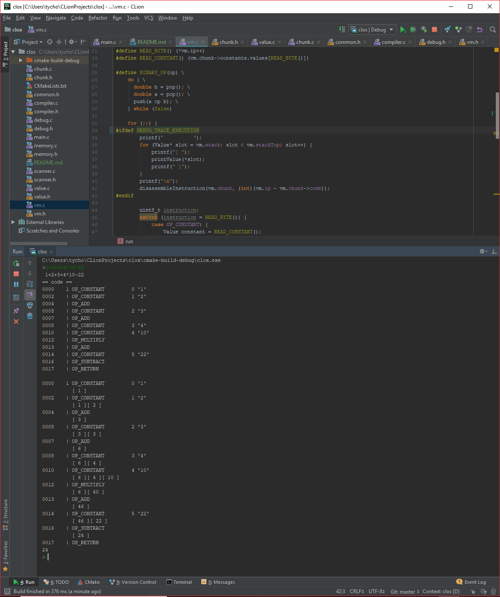

# CLOX

All credits goes to  [Robert (? Bob ?) Nystrom](https://twitter.com/munificentbob).

He made a wonderful tutorial  to crate your own language here: http://craftinginterpreters.com/
It is gold content, super clearly explained.

This is part 2 (where we create a full VM in C).

